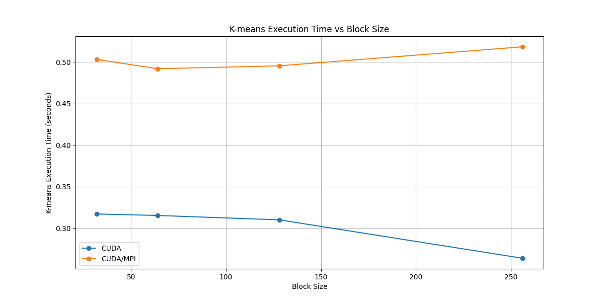

# Scaling Study: Distributed Memory: CPU vs. GPU (MPI and CUDA + MPI)

## Introduction

Something here explaining what we're doing

*All information regarding the implementation of the programs discussed is available at ['docs/designApproaches.md'](docs/designApproaches.md)*

## Experimental Setup

- All benchmarking is done on the [Univeristy of Utah High Performance Cluster](https://www.chpc.utah.edu/) on the Notchpeak GPU's.
- The time a program takes to complete is measured by the time it takes strictly for the program to process the information.
  - The time it takes to parse the input and write the output is not included

## Results

## Conclusion

Overall, we see that the CUDA implementation is the most efficient across all block sizes.  This is surprising to us as we assumed that the CUDA+MPI would be the most effective overall, but this wasn't the case.
