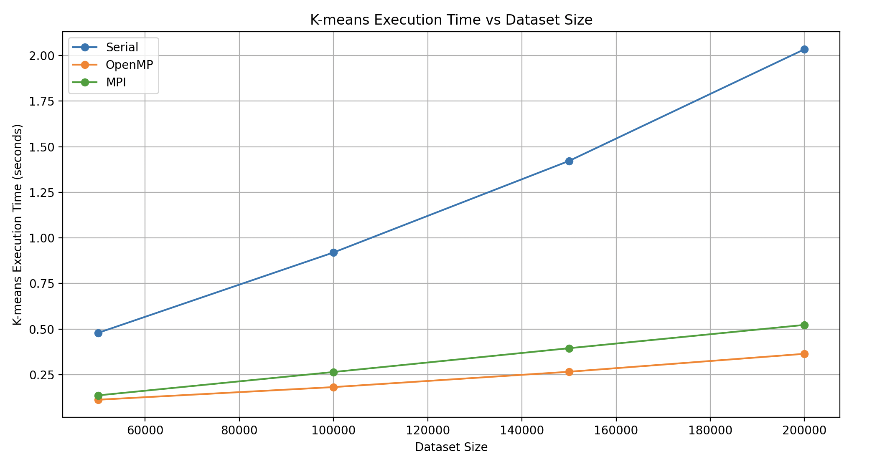

# Scaling Study: Serial vs. Parallel (OpenMP and CUDA)

## Introduction

Something here explaining what we're doing

*All information regarding the implementation of the programs discussed is available at ['docs/designApproaches.md'](docs/designApproaches.md)*

## Experimental Setup

- This particular test was run on a M1 Macbook Pro
- The time a program takes to complete is measured by the time it takes strictly for the program to process the information.
  - The time it takes to parse the input and write the output is not included

## Results

## Conclusion

Overall, we see that the OpenMP implementation is the most efficient at high dataset sizes, this implies that it is the best at evenly splitting the load among threads in this study.  While MPI does a good job it has slightly more overhead than OpenMP leading to only slightly worse times when processing a large dataset.  As would be expected the serial implementation even with smaller datasets has the longest execution time.
